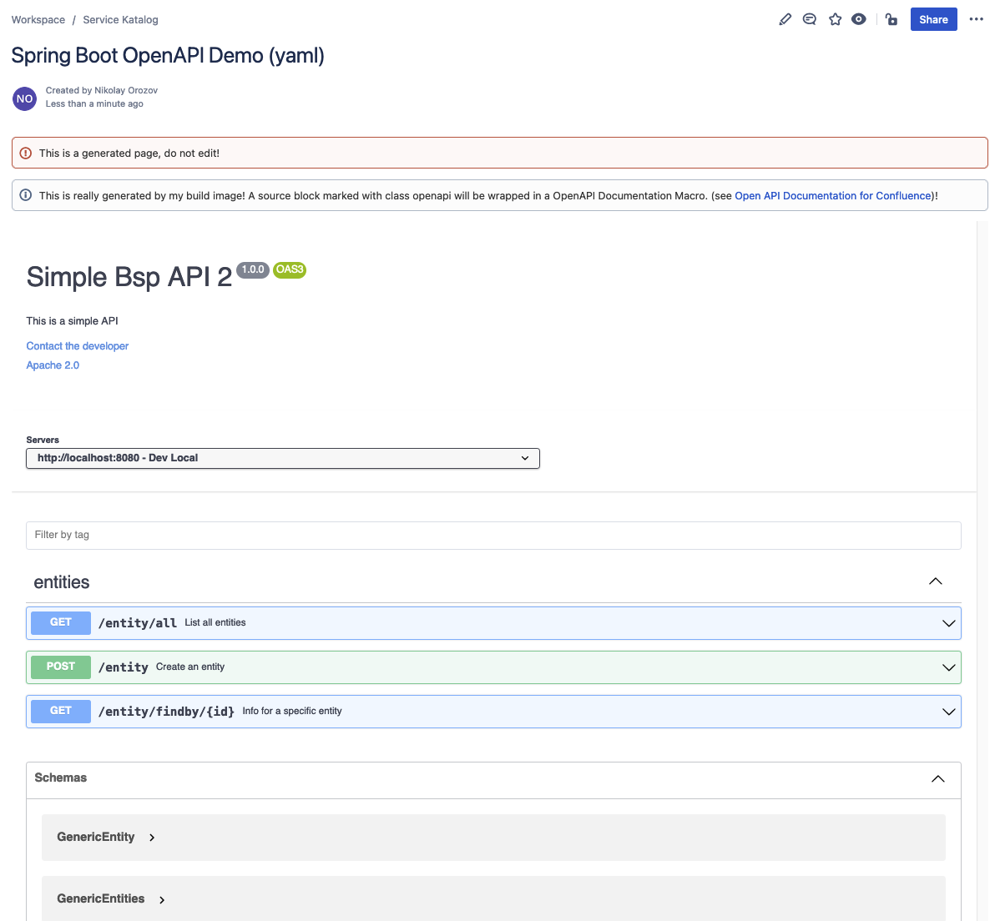

# Demo Integrated docToolchain 

This demo project consist of
* Spring Boot (v2.4.5) Service (OpenJDK-1.8, Maven 3.8.3)
* OpenAPI definition for the Spring Boot Service `src/docs/service-api.yaml` 
* Asciidoc API documentation `src/docs/service-api.adoc` which for the OpenAPI (yaml)  definition
* OpenAPI definition for the Petstore example service to demonstrate the JSON format `src/docs/petstore-api.json`
* Asciidoc API documentation `src/docs/petstore-api.adoc` which for the OpenAPI (json) definition
* Config (`Config.groovy`) for [docToolchain](https://doctoolchain.github.io/docToolchain/)
* Dockerfiles for the Spring-Boot-Service and baked-in docToolchain 

### My own Confluence instance 'nikonfluence'
The result is visible on my own [Confluence instance](https://nikonfluence.atlassian.net).

Using the builder-alpine-doctoolchain image you can generate and publish your documentation (Asciidoc format) and OpenAPI-Definitions (yaml or json format) to Confluence.
Her is the result in [Confluence](https://nikonfluence.atlassian.net/l/c/wLy4m800)

The result as screenshot: 

### Build and Run the Spring-Boot service locally with Maven
From your command line:
* `mvn clean verify`
* `mvn spring-boot:run`
* then open your browser and go to http://localhost:8080/entity/all

### HowTo build Docker images

* Dockerfile: Crates an image for starting the HelloWorld-service locally
* * `docker build --no-cache . -t spring-boot-openapi-demo:1.0.0` 
* * `docker run -it --rm -p 8080:8080 spring-boot-openapi-demo:1.0.0`
* * go to http://localhost:8080/entity/all

* Dockerfile-doc-builder: 
* * uses openjdk:8-jre-alpine and docToolchain 2.x 
* * installs libs to allow generating and publishing PlantUML diagrams 
* `docker build --no-cache . -t builder-alpine-doctoolchain:2.0.0 -f Dockerfile-doc-builder`

### Run docToolchain-publishToConfluence locally using Docker (builder-alpine-doctoolchain:2.0.0 image)
Preconditions: 
* the directory under `/full-path-to-your-service-repo` must contain a valid docToolchain Config.groovy
* Confluence credentials with R/W-access

Then from your command line run the command: 
* `docker run -it --rm -v "/full-path-to-your-service-repo":/source builder-alpine-doctoolchain:2.0.0 doctoolchain /source publishToConfluence -PconfluenceUser="your-confluence-username" -PconfluencePass="your-confluence-api-token"`

### Maven Reference Documentation
For further reference, please consider the following sections:

* [Official Apache Maven documentation](https://maven.apache.org/guides/index.html)
* [Spring Boot Maven Plugin Reference Guide](https://docs.spring.io/spring-boot/docs/2.4.5/maven-plugin/reference/html/)
* [Create an OCI image](https://docs.spring.io/spring-boot/docs/2.4.5/maven-plugin/reference/html/#build-image)
* [Spring Web](https://docs.spring.io/spring-boot/docs/2.4.5/reference/htmlsingle/#boot-features-developing-web-applications)

### Spring Boot Guides
The following guides illustrate how to use some features concretely:

* [Building a RESTful Web Service](https://spring.io/guides/gs/rest-service/)
* [Serving Web Content with Spring MVC](https://spring.io/guides/gs/serving-web-content/)
* [Building REST services with Spring](https://spring.io/guides/tutorials/bookmarks/)
